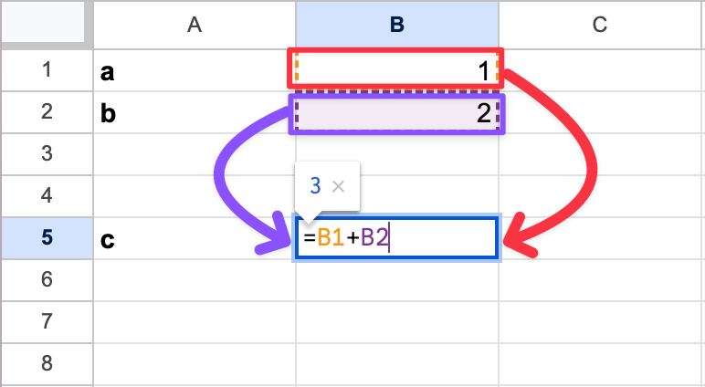
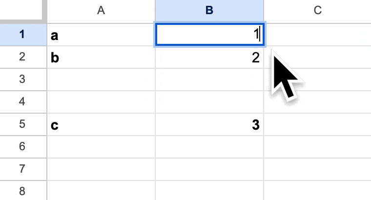

```python {.marimo}
import marimo as mo
import polars as pl
import polars.selectors as cs
```

# Getting Started with marimo and Polars
<!---->
## Agenda
- ~15 Minutes: **The _what_ and _why_ of marimo**
- ~40 Minutes: **Hands-on on session with Polars** *(inside marimo)*
<!---->

## marimo
<!---->
### ✋ Poll

- Do you use notebooks?
<!---->
### ✋ Poll

- Have you used marimo before?
<!---->
### What?

- [yet another](https://jupyter.org/) [(python) notebook!?](https://colab.google/)
<!---->
### Why?

- Reproducibility
- Exploration
<!---->
#### Reproducibility

**Problem: Hidden State**

Your notebook *can* produce different results when you:

- Execute cells out of *(the intended)* order.
- Delete cells without clearing their variables.
<!---->
#### Reproducibility

**Problem: Hidden State**

```python
# Cell 1
a = 1
```
```python
# Cell 2
a = 2
b = 2
```
```python
# Cell 3
c = a + b
print(c)
```
<!---->
#### Reproducibility

**Problem: Hidden State**

```python
# Cell 1
a = 1
```
```python
# Cell 2
a = 2
b = 2
```
```python
# Cell 3
# c = a + b <-- NOTICE 'c' IS NOW COMMENTED OUT
print(c)
```
<!---->
#### Reproducibility

**Solution: Reactive Execution**

- Run a cell, and marimo _reactively_ runs **all dependent cells**
<!---->
#### Reproducibility

**Solution: Reactive Execution**


<!---->
#### Reproducibility

**Solution: Reactive Execution**


<!---->
#### Reproducibility

**Solution: Reactive Execution**


<!---->
#### Reproducibility

**Solution: Reactive Execution**

Demo

```python {.marimo name="cell1"}
# Cell 1
a = 2
```

```python {.marimo name="cell2"}
# Cell 2
# NO VARIABLE REDEFINITIONS ACROSS CELLS
# a = 2
b = 2
```

```python {.marimo name="cell3"}
# Cell 3
c = a + b
print(c)
```

#### Exploration

**Problem: 'Static' Output**

- You'll get a (non-interactive) table and you will be happy!
<!---->
###
<!---->
#### Exploration

**Problem: 'Static' Output**

- You'll get a (non-interactive) table and you will be happy!
<!---->
#### Exploration

**Solution: Interactive Widgets** as tools for (data) thought

- [anywidget](https://anywidget.dev/en/getting-started/) 🤝 marimo

Demo
<!---->
#### Exploration

**Solution: Polyglot Workflow**

- Python 🤝 [(DuckDB) SQL](https://duckdb.com/)

Demo
<!---->

## Polars

```python {.marimo hide_code="true"}
mo.md(r""" """)
```